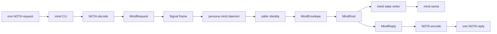
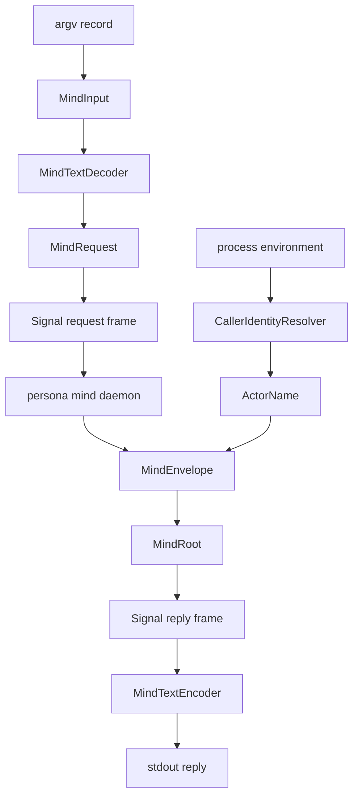
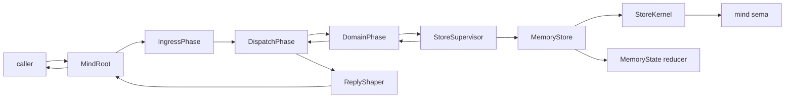
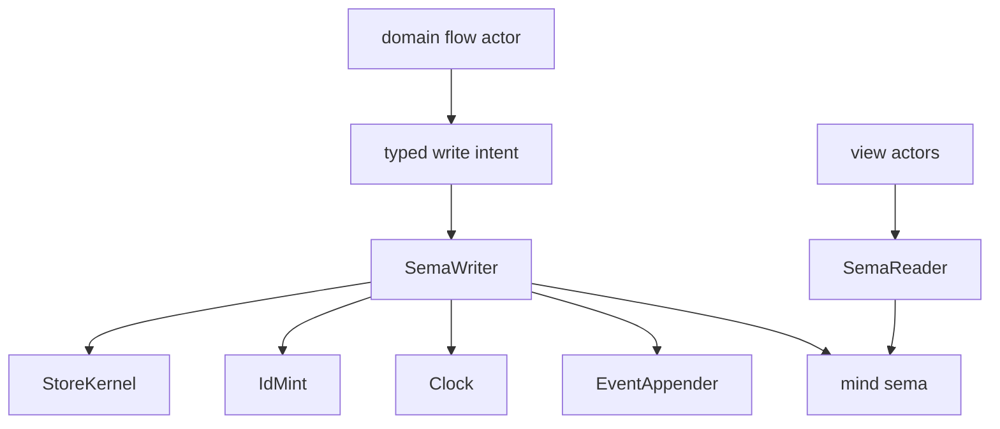
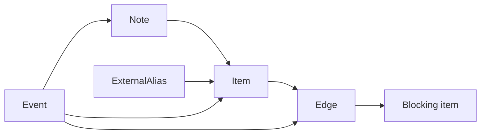

# mind — architecture

*Central Kameo actor system for Persona mind state, work memory, and the
command-line mind.*

> Status: the crate has a real Kameo runtime, mind-local Sema tables for
> the work graph, typed Thought/Relation records, and fixture-guarded
> accepted-knowledge records. Typed graph records use
> `sema-engine` for Assert/Match, operation-log snapshots, subscription
> registration, reusable payload-bearing version replay, and post-commit
> subscription delta delivery into `SubscriptionSupervisor`. Older work
> tables still use the same underlying `sema` kernel handle while they await
> migration. The crate also has a
> Unix-socket Signal-frame daemon/client transport around `MindRoot`. The
> `mind` binary can run a daemon and submit NOTA work-graph
> opening/note/link/status/alias/query requests and full
> `signal-mind::MindRequest` graph requests through that daemon.

> **Scope.** "Sema" in this document is today's `sema` library (typed
> storage kernel). The eventual `Sema` is
> broader (universal medium for meaning); today's mind is a
> realization step on the eventually-self-hosting stack, built rightly
> for the scope it serves now. See `~/primary/ARCHITECTURE.md` §"Workspace vision and intent".

## 0 · TL;DR

`mind` owns Persona's central workspace state: work items, typed
Thought and Relation records, notes, dependencies, decisions, aliases, event
history, subscriptions, channel choreography policy, and ready/blocked views.
Ordinary role claims, handoffs, and activity live in `orchestrate`.
Lock files are not part of this implementation; they are a temporary workspace
coordination mechanism that will be retired by the orchestrate/mind stack.
BEADS entries may be imported as history/aliases, but BEADS is not a live
backend.

All public operations enter through `signal-mind` records. The
command-line surface is the `mind` binary: exactly one NOTA request record in,
exactly one NOTA reply record out. The binary is a thin client, not a second
command language. It decodes NOTA into `MindRequest`, resolves caller identity,
wraps the request in a Signal frame, sends that frame to a long-lived
`mind` daemon, and prints the daemon's NOTA `MindReply`.

The daemon owns `MindRoot` for its process lifetime. Tests and early
scaffolding use `ActorRef<MindRoot>` directly; there is no separate in-process
runtime facade. Request phases that currently exist as trace witnesses become
real actors when they own state, IO, failure, identity, time, IDs, or
transaction ordering.



## 1 · Public Surface

The crate exposes:

| Surface | Purpose |
|---|---|
| `MindEnvelope` | Infrastructure-supplied caller identity plus one `MindRequest`. |
| `ActorRef<MindRoot>` | Direct Kameo root actor surface for in-process tests and daemon scaffolding. |
| `MindRootReply` | Typed reply plus actor trace witness. |
| `MemoryState` | Current in-memory work/memory reducer used behind the actor path. |
| `actors::ActorManifest` | Runtime topology witness. |
| `actors::ActorTrace` | Per-request path witness for architectural-truth tests. |
| `MindDaemonEndpoint` | Unix-socket endpoint value for the local daemon transport. |
| `MindFrameCodec` | Length-prefixed Signal frame codec used by client and daemon. |
| `MindClient` | Thin local client that attaches Signal caller identity, submits one request frame, and reads one reply frame. |
| `MetaMindEndpoint` | Owner-only meta policy socket endpoint value. |
| `MetaMindFrameCodec` | Length-prefixed `meta-signal-mind` frame codec. |
| `MetaMindClient` | Thin local owner client for `meta-signal-mind` operations. |
| `MindDaemon` | Bound one-shot daemon harness around `MindRoot`; reads actor identity from required Signal caller context before entering the root actor. |
| `MindCommand` | Process-boundary command parser for daemon mode and one NOTA request submission. |
| `MetaMindCommand` | Process-boundary parser for one owner meta-policy NOTA request. |
| `MindTextRequest` / `MindTextReply` | Current NOTA projection for work-graph request/reply records plus full contract requests. |
| `mind` binary | Daemon-backed command-line mind for central mind state. |
| `meta-mind` binary | Daemon-backed owner-side meta policy client. |

The public protocol is not defined here. `signal-mind` owns the
request and reply records. `mind` consumes those records and applies
state transitions.

## 2 · Command-line Mind

The command-line mind is a thin client boundary over a long-lived daemon. The
daemon owns the runtime path. The current crate has a Unix-socket daemon,
Signal-frame transport, and a NOTA projection for work-graph operations. The
CLI also accepts a full `signal-mind::MindRequest` NOTA record when the
convenience projection has no shorthand.

Command-line interfaces in this workspace interact with daemons. The
command-line mind is not a one-shot state owner and should not reopen that
decision.



Process-boundary types should be small and data-bearing:

| Type | Owns |
|---|---|
| `MindCommand` | exactly one ordinary NOTA argument, `MIND_SOCKET` / `MIND_ACTOR` environment defaults, exit rendering. |
| `MetaMindCommand` | exactly one owner meta-policy NOTA argument, `MIND_META_SOCKET` environment default, exit rendering. |
| `MindTextRequest` | exactly-one-record rule for implemented request records. |
| `MindTextReply` | NOTA rendering for implemented reply records. |
| `MindClient` | caller identity in Signal caller context plus request/reply exchange. |
| `MetaMindClient` | owner meta-policy request/reply exchange. |
| `MindDaemonEndpoint` | local daemon endpoint default and explicit override. |

No request payload mints authority. Actor identity, timestamps, event sequence,
operation IDs, and display IDs are infrastructure/store concerns.

The ordinary `mind` CLI takes no flags. It receives exactly one NOTA record
or NOTA file path; socket and actor defaults come from `MIND_SOCKET` and
`MIND_ACTOR`, with development defaults of `/tmp/mind.sock` and `operator`.
The owner-side `meta-mind` CLI follows the same one-argument shape over the
`meta-signal-mind` contract and reads its socket from `MIND_META_SOCKET`
with a development default of `/tmp/meta-mind.sock`.

## 3 · Runtime Topology

Current long-lived actors:

```mermaid
graph TB
    root --> ingress[IngressPhase]
    root --> dispatch[DispatchPhase]
    root --> domain[DomainPhase]
    root --> store[StoreSupervisor]
    store --> kernel[StoreKernel]
    store --> memory[MemoryStore]
    store --> graph[GraphStore]
    root --> views[ViewPhase]
    root --> subscriptions[SubscriptionSupervisor]
    root --> choreography[ChoreographyAdjudicator]
    root --> reply[ReplyShaper]
```

`ReplyShaper` shapes exactly one reply per request; it does not supervise
children. The name reflects verb-belongs-to-noun: it is a shaping verb on the
reply path, not a supervision relationship.

### ChoreographyAdjudicator

`ChoreographyAdjudicator` is an optional child of `MindRoot` when the root
is started with an orchestrate meta endpoint. The current shipped slice
owns the outbound `MindOrchestrateCaller` path for Create / Retire /
Refresh decisions; the full channel-choreography policy plane is still
destination work. That destination plane holds:

- `policy: ChoreographyPolicy` — the live policy that decides grant/deny;
- a grant table keyed by `ChannelIdentifier` (`HashMap<ChannelIdentifier, ChannelGrant>`)
  carrying the active grants;
- an adjudication log of accepted/denied requests for audit and replay.

It handles the full choreography family — `AdjudicationRequest`,
`ChannelGrant`, `ChannelExtend`, `ChannelRetract`, `AdjudicationDeny`,
`ChannelList` — and routes `SubscriptionRetraction` requests by closing the
named subscription's stream and emitting the `SubscriptionRetracted` reply.
Both the retract request and the retracted reply are first-class per the
`signal_channel!` streaming grammar.

Status: partial. Manual decision injection is live and tested against
orchestrate's real meta signal socket. Ordinary inbound choreography
request variants still route to
`MindReply::MindRequestUnimplemented(NotInPrototypeScope)` until the
policy that derives a concrete decision from those observations is built.

### Subscription push delivery (destination)

The destination shape for typed graph subscription push delivery splits
`SubscriptionSupervisor` into three actors:

- **`SubscriptionManager`** — owns subscription metadata: subscription IDs,
  registration state, the durable filter row, last-acked delta cursor.
  Persists through `StoreKernel` to `thought_subscriptions` /
  `relation_subscriptions` in `mind.sema`.
- **`StreamingReplyHandler`** (one per live subscription) — owns the reply
  channel for that subscription, buffers post-commit deltas under the
  consumer's signalled demand, and emits the terminal
  `MindReply::SubscriptionRetracted` reply when the consumer's
  `MindRequest::SubscriptionRetraction` request closes the stream (or when
  the producer terminates the stream itself).
- **`SubscriptionDeltaPublisher`** — fires after each store commit; reads
  the committed delta, looks up matching subscriptions through
  `SubscriptionManager`, and hands typed delta records to the matching
  `StreamingReplyHandler`s.

Backpressure is consumer-driven: the consumer signals
`MindRequest::SubscriptionDemand(n)`; `StreamingReplyHandler` releases up
to `n` deltas and then waits. There is no unbounded
`SubscriptionSupervisor::events: Vec<_>` buffer in the destination shape.

Status: destination. Today `SubscriptionSupervisor` collects post-commit
deltas behind an in-actor buffer; the three-actor split with
consumer-driven demand and the typed retract/retracted close discipline
is transitional → destination.

Current request path for implemented memory/work operations:



`TraceNode` currently names both real Kameo actors and trace phases. The
manifest distinguishes them through residency. That is acceptable as a staging
tool, but stateful phases must graduate into real actors as implementation
lands.

| Trace phase | Graduation trigger |
|---|---|
| `NotaDecoder` | owns text diagnostics and parse failure. |
| `CallerIdentityResolver` | owns caller resolution and authority failure. |
| `GraphFlow` / `GraphStore` | owns typed Thought/Relation append and query. |
| `SemaWriter` | owns write ordering and transaction failure. |
| `SemaReader` | owns read snapshots. |
| `IdMint` | owns stable/display ID collision state. |
| `Clock` | owns store-supplied time. |
| `EventAppender` | owns append-only event ordering. |

## 4 · State and Storage

Current implementation:

- `StoreSupervisor` supervises `StoreKernel`, `MemoryStore`, and `GraphStore`.
- `StoreKernel` is the only actor that opens and owns the `MindTables` handle
  over `mind.sema`.
- `StoreKernel` runs as a normal supervised Kameo child, not
  `spawn_in_thread()`. It owns the `MindTables` handle, and Kameo 0.20 signals
  supervised dedicated-thread shutdown before actor state is necessarily
  dropped; keeping the durable store owner on `.spawn()` avoids that lifecycle
  race. `StoreSupervisor` still sends `ShutdownKernel` before stopping children,
  so the database handle is closed explicitly. The witness is
  `store_kernel_supervised_thread_restart_reopens_same_database`: a first
  `MindRoot` commits to `mind.sema`, stops, and a second `MindRoot` immediately
  reopens the same database and reads the committed state.
- `MindTables` schema v11 registers every durable mind table as a
  `sema-engine` record family with typed family identity: the
  `memory_graph` snapshot, the typed Thought/Relation graph records,
  typed TechnicalNode/TechnicalRelation records, accepted knowledge records,
  and the graph plus technical subscription registrations. There are no
  component-local storage-kernel tables left; every durable write goes
  through the engine's logged choke points.
- `MemoryStore` owns the private `MemoryState` reducer and commits accepted
  work/memory snapshots through `StoreKernel`.
- `GraphStore` routes `SubmitThought`, `SubmitRelation`, `QueryThoughts`,
  `QueryRelations`, `SubscribeThoughts`, and `SubscribeRelations` to
  `StoreKernel`, where `MindGraphLedger` writes typed `Thought`/`Relation`
  records through `sema-engine`, reads them through `sema-engine` Match
  queries, registers subscriptions through `sema-engine` Subscribe, and stores
  only Persona-specific subscription filters through the storage-kernel handle
  exposed by `sema-engine`.
- Accepted knowledge routes `SubmitKnowledge` and `QueryKnowledge` through the
  same actor/store lane. The store persists only accepted
  `AcceptedKnowledge` records in the `accepted_knowledge` family. Deterministic
  preflight rejects missing relation endpoints and relation domain/range
  violations before the typed judge port is called; semantic rejections and
  accepted admission receipts are not stored.
- `SubscriptionSupervisor` receives post-commit graph deltas from
  `sema-engine` subscription sinks and publishes typed
  `signal-mind::SubscriptionEvent` records for matching durable
  filters. Thought filters are evaluated against the current relation snapshot
  through the store actor path; relation filters are evaluated directly. The
  in-actor delta buffer is transitional; the destination split into
  `SubscriptionManager` + `StreamingReplyHandler` + `SubscriptionDeltaPublisher`
  with consumer-driven demand lives in §3.
- Subscription close follows the `signal_channel!` streaming grammar:
  `Subscribe` opens the stream, the consumer sends a typed
  `Retract SubscriptionRetraction(SubscriptionIdentifier)` request to close,
  and the producer returns `MindReply::SubscriptionRetracted` as the
  final acknowledgement before the stream ends. Both the request-side
  retract verb and the reply-side acknowledgement are first-class. The
  `signal_channel!` macro emits a `closed_stream()` discriminant on the
  request enum from this pairing — that is the binding shape, not a
  transitional one.
- The emitted daemon's owner socket accepts `meta-signal-mind` frames
  and returns typed `RequestUnimplemented(NotBuiltYet)` replies for the
  current `Configure` / `Inspect` policy operations. The same owner socket
  still accepts the existing `signal-persona` supervision relation frames;
  the daemon peeks at the first length-prefixed binary frame to select the
  contract and then preserves the supervision stream when that was the
  arriving protocol. Policy storage and policy evaluation remain destination
  work.
- Work/memory mutations append typed `Event` values in the reducer, then
  replace the typed Sema graph snapshot before success replies are emitted.
- Queries read the loaded work graph through `MemoryStore` and produce typed
  `View` replies.
- Work/memory requests and typed mind-graph create/query/subscription requests
  are routed through the actor path.

Destination:



The durable store is one workspace-local `mind.sema` owned by
`mind`. `sema-engine` owns the single storage-kernel handle used by
`MindTables`; every durable mind table is a registered engine record
family written through engine verbs, so every durable write lands in the
commit log and the versioned log. The engine hands out only a read-only
`StorageReader`; mind no longer holds any write path around the logged
choke points. The mind-specific Sema layer and table declarations belong
to `mind` because mind owns this state. There is no shared
`persona-sema` layer for mind state. Other components talk to mind
through `signal-mind`.

`MindTables` opens `sema-engine` with `VersioningPolicy` store name
`mind`; each registered family declares a `FamilyName` and a per-family
schema hash (a typed label-derived stand-in until schema generation
supplies content hashes), and the store-level schema hash is derived by
the engine from that inventory. That makes every durable write land in
the engine-owned payload-bearing version log in the same `mind.sema`
transaction as the data row. Mind does not maintain a separate backup
journal; remote mirror/server policy belongs to the reusable SEMA-state
versioning layer above `sema-engine`.

`sema-engine` is the exclusive interface to the database: mind holds no
storage-kernel write path and makes no direct redb calls (per Spirit fosp,
Correction). The versioned operation log — not the redb store — is the
authoritative source of truth for mind's Sema state; the redb store is a
rebuildable materialized view folded from that log (per Spirit iir4,
Decision).

Recommended tables:

| Table | Purpose |
|---|---|
| `memory_graph` | Current typed graph snapshot for the first durable implementation wave. |
| `thoughts` | `sema-engine` registered family for append-only typed `Thought` records; IDs are compact three-letter values minted from the engine snapshot sequence. |
| `relations` | `sema-engine` registered family for append-only typed `Relation` records between thoughts; relation IDs use the same compact sequence policy but stay a distinct `RelationIdentifier` type. |
| `accepted_knowledge` | `sema-engine` registered family for accepted entities, statements, relations, domains, and sources admitted through the typed knowledge judge port. |
| `thought_subscriptions` | Durable Persona-specific `SubscribeThoughts` filters keyed by IDs minted from `sema-engine` subscription handles. |
| `relation_subscriptions` | Durable Persona-specific `SubscribeRelations` filters keyed by IDs minted from `sema-engine` subscription handles. |
| `items` | Work/memory/decision/question records. |
| `notes` | Notes attached to items. |
| `edges` | Dependencies and references. |
| `aliases` | Imported or external identifiers, including BEADS IDs. |
| `events` | Append-only state mutation history. |
| `meta` | schema version and store identity. |

The event log is the audit trail. Current-state tables and views are derived
state optimized for queries.

## 5 · Orchestration Boundary

Ordinary role claims, handoffs, and activity moved to `orchestrate`.
The corresponding wire records moved to `signal-orchestrate`.

`mind` still owns central state that orchestrate may read or propose
against: typed work records, typed thoughts and relations, durable graph
subscriptions, and channel choreography policy. Do not add lock-file
projections or reintroduce ordinary role/activity tables here; migration away
from lock files is handled by the orchestrate/mind stack boundary, not inside
the mind implementation.

## 6 · Work and Memory Graph

The work graph is the typed replacement for BEADS as an active project memory
substrate. BEADS entries may be imported once as aliases or external
references; Persona should not grow a long-term BEADS bridge.

Implemented reducer requests:

- `Open`
- `AddNote`
- `Link`
- `ChangeStatus`
- `AddAlias`
- `Query`

Required graph invariants:

- Items have stable internal IDs and short display IDs.
- Dependencies are typed edges, not string fields.
- Notes are append-only records attached through events.
- Imported IDs become aliases or external references.
- Ready/blocked views derive from item status and dependency edges.
- Queries do not mutate state.



## 6.4 · Future direction — memory, error events, and role-vector skill loading

These archived intent records name capabilities `mind` is intended to own once
`persona-mind` ships; they are direction, not yet built surface.

- **Agent-error event logging (`wgii`).** Agent errors — mermaid syntax, NOTA
  formatting, naming violations, and the like — are logged into Mind as typed
  events, forming the basis for skill-improvement loops and auditor input.
- **Shared agent memory (`wl2a`).** Agent memory defaults route through a
  reliable shared memory system shared across agents; Claude-specific memory
  use is an explicit gated path, not the default.
- **Role-vector-driven skill loading (`x92t`).** Each token in a lane's role
  vector contributes to the default skill bundle `persona-mind` sends at boot.
  A lane with role `[PersonaSignal Designer]` loads the base designer skills
  (`skills/designer.md`) plus persona-signal-specific skills; `[Note Designer]`
  loads designer skills plus note-specific. Specialization tokens map directly
  to skill files or registered skill bundles. This composes with the existing
  intent that skills bundle into roles, refining it so the bundle is derivable
  from the role vector rather than from a single role string. (The role-vector
  encoding itself is owned by `orchestrate`'s lane registry; `mind` consumes it
  to compose the boot-time skill bundle.)

## 6.5 · Supervision-relation reception

The mind daemon answers the `signal-persona::SupervisionRequest` relation
from a canonical `SupervisionPhase` Kameo actor inside `MindRoot`'s tree.
The phase actor carries `component_name`, `component_kind`,
`supervision_protocol_version`, and the cached `ComponentHealth` pushed
from the domain plane. For domain operations whose behavior is not yet
built, `MindRoot` replies
`MindReply::MindRequestUnimplemented(NotInPrototypeScope)` — a typed
answer, not a panic. The channel-choreography family
(`AdjudicationRequest`, `ChannelGrant`, `ChannelExtend`,
`ChannelRetract`, `AdjudicationDeny`, `ChannelList`,
`SubscriptionRetraction`) routes to `ChoreographyAdjudicator` in the
destination shape. The first shipped slice is the outbound
`MindOrchestrateCaller`: tests manually inject choreography decisions and
prove they call orchestrate's meta socket. Ordinary inbound
`AdjudicationRequest` routing is still a typed
`Unimplemented(NotInPrototypeScope)` until the policy that turns channel
observations into decisions is built. The mind daemon reads its
`signal-persona::SpawnEnvelope` at startup, binds `mind.sock` at the named
mode, and proceeds.

## 6.6 · Authority direction — `Mutate` flows down-tree

`mind` is the authority root of the Persona control plane. The
verbs it *issues outbound* and the verbs it *receives inbound* are not
symmetric:

| Verb | Inbound to mind | Outbound from mind |
|---|---|---|
| `Assert` | accepted (peers append typed facts to mind state) | rare (mind's writes are usually authority orders, not bare facts) |
| `Match` | accepted (callers query mind state) | issued (mind queries peer state when adjudicating) |
| `Subscribe` | accepted (peers subscribe to mind state changes) | issued (mind subscribes to router/harness/orchestrate events to *observe* — per `skills/push-not-pull.md`) |
| `Mutate` | rare (only from a higher authority, e.g. user-on-record) | **issued** (the authority verb — mind orders peers to change) |
| `Retract` | rare | issued (mind orders peers to remove typed records) |
| `Validate` | accepted | issued (mind dry-runs orders against peer policy) |

The shape is **observe up-tree, order down-tree** (per
`~/primary/skills/component-triad.md` §"The six verbs and what each one
means"). Mind subscribes to delivery / lifecycle / adjudication events from
`router`, `harness`, and `orchestrate`; mind *decides*;
mind issues `Mutate` / `Retract` orders down to those same components. Each
recipient obeys and confirms; mind holds *possibly-mutated* state until the
confirmation, then advances.

`ChannelGrant`, `ChannelExtend`, `ChannelRetract`, and
`AdjudicationDeny` (handled by `ChoreographyAdjudicator`, §3) are
**outbound `Mutate` / `Retract` orders**: mind authoritatively tells
the router to install / extend / remove a channel; the router obeys
and acks. The router does not adjudicate the grant on its own; that
authority lives in mind. The `AdjudicationRequest` that surfaces a
channel-miss is an inbound *observation* (`Assert`/`Match`-shaped),
not an inbound order.

Mind's `Mutate` chain extends downward through `orchestrate`: mind
issues future `SpawnAgent` / `SuperviseAgent` / `EscalateBlockedWork` orders to
orchestrate; orchestrate may then issue its own `Mutate` orders to
`harness` (spawn) and `router` (install the agent's permitted
channels). The `(mind -> orchestrate -> router -> harness)` authority chain is
the canonical worked example in `~/primary/skills/component-triad.md`
§"Authority chain — worked example".

## 6.7 · MindOrchestrateCaller

`ChoreographyAdjudicator` now has a concrete outbound caller for the first
three orchestrate meta verbs:

| Decision | Meta request | Expected orchestrate effect |
|---|---|---|
| `OrchestrateDecision::Create(CreateRoleOrder)` | `MetaOrchestrateRequest::Create` | role registry records a new role and report lane |
| `OrchestrateDecision::Retire(Retirement)` | `MetaOrchestrateRequest::Retire` | role or lane is retired |
| `OrchestrateDecision::Refresh(RefreshRepositoryIndexOrder)` | `MetaOrchestrateRequest::Refresh` | repository index is refreshed |

`MindOrchestrateCaller` owns the Unix-socket client connection to
orchestrate's meta socket and speaks the existing
`meta-signal-orchestrate` frame. It does not mutate mind-local
state and does not call `orchestrate` internals. Its job is the
mind-to-body authority handoff: a typed mind decision becomes one meta
signal frame, the meta reply returns through the adjudicator, and the
trace records `ChoreographyAdjudicator -> MindOrchestrateCaller`.

The current tests use manual decision injection because the upstream policy
that derives a decision from an intent or channel-miss observation remains
unbuilt. That keeps the boundary honest: Create / Retire / Refresh are live
transport and live orchestrate-state mutations, while policy derivation is a
separate missing slice.

## 7 · Boundaries

This repo owns:

- the `mind` CLI binary and process-boundary logic;
- the `meta-mind` owner CLI binary and process-boundary logic;
- Kameo runtime topology for the central mind;
- work/memory graph behavior;
- typed Thought/Relation graph behavior;
- graph subscription registration and post-commit delta delivery;
- channel choreography policy and authorization state;
- durable `mind.sema` ownership;
- mind-specific architectural-truth tests.

This repo does not own:

- `signal-mind` contract records;
- `meta-signal-mind` contract records;
- ordinary role claim/release/handoff/activity behavior, which belongs to
  `orchestrate`;
- router delivery or harness messaging;
- terminal transport, which belongs to `terminal`;
- OS/window-manager observation;
- `sema` kernel internals;
- a shared database for other components;
- BEADS as a live backend.

## 8 · Constraints

- The `mind` CLI accepts exactly one NOTA request record and prints exactly one
  NOTA reply record.
- The `mind` CLI accepts no flags; socket and actor defaults come from
  `MIND_SOCKET` and `MIND_ACTOR`.
- The `meta-mind` CLI accepts exactly one `meta-signal-mind` NOTA request
  record and prints exactly one meta reply record.
- The `meta-mind` CLI accepts no flags; the owner socket default comes from
  `MIND_META_SOCKET`.
- CLI constraint tests run the production `mind` binary through Nix.
- CLI constraint tests start a real daemon when the constraint requires
  runtime state.
- The `mind` CLI sends Signal frames to the long-lived `mind` daemon;
  it does not own `MindRoot`.
- The `mind` CLI supports work-graph opening/note/link/status/alias/query text
  records and full `signal-mind::MindRequest` NOTA records.
- `MindClient` sends one length-prefixed Signal request frame to the daemon and
  expects one length-prefixed Signal reply frame back.
- `MindClient` supplies caller identity through Signal caller context, not
  through the request payload.
- `MindDaemon` routes request frames through `MindRoot`; it does not construct
  success replies without the actor path.
- `MindDaemon` rejects request frames that do not carry Signal caller identity.
- Current Signal caller identity is a required claimed frame identity, not a
  cryptographic or socket-credential auth proof; real auth proof remains a
  follow-up to the frame/auth layer.
- `MindDaemon` routes `meta-signal-mind` owner policy frames on the owner
  socket to typed meta replies instead of closing the stream silently.
- A missing daemon cannot produce a client reply.
- The daemon owns `MindRoot` for its process lifetime.
- The daemon owns `mind.sema`; the CLI never opens the database.
- `StoreKernel` is the only store actor that opens and owns the `MindTables`
  handle for `mind.sema`.
- `MemoryStore` and `GraphStore` do not open separate database handles; they ask
  `StoreKernel`.
- Work/memory writes replace the typed `memory_graph` snapshot in `mind.sema`
  before producing success replies.
- Typed graph thought/relation writes use `sema-engine` Assert on registered
  `thoughts` / `relations` record families before producing success replies.
- Typed graph IDs are compact sequence-derived tokens minted from the
  `sema-engine` snapshot sequence; they are not content hashes, timestamps,
  payload fields, or strings with embedded type prefixes.
- Typed graph ID continuity survives reopening `mind.sema`; the next append
  continues from the persisted engine snapshot and does not collide with
  existing graph records.
- Typed graph thought/relation queries use `sema-engine` Match on registered
  `thoughts` / `relations` record families.
- Typed graph writes create `sema-engine` operation-log entries in the same
  transaction as the graph record.
- Typed graph writes also create `sema-engine` payload-bearing version-log
  entries when `MindTables` opens `mind.sema`; this is the reusable
  SEMA-state versioning substrate, not a Mind-specific journal.
- `SubmitThought.kind` must match `SubmitThought.body.kind()`; contradictory
  records are rejected before persistence.
- `SubmitRelation` must reference existing thought IDs; missing endpoints are
  rejected before persistence.
- `SubmitRelation` must pass the `signal-mind` relation
  endpoint validator; runtime-local relation folklore is not accepted.
- `SubmitTechnicalNode` must carry a canonical `TechnicalNodeKey` whose family
  matches the submitted node kind; malformed keys reject before persistence.
- Technical storage facts are first-class graph records:
  `StorageResource`, `SchemaFamily`, and `Table` nodes persist and query through
  the same actor lane as other technical nodes.
- Technical dependency relations use split `BuildDependency`,
  `RuntimeDependency`, `WireDependency`, `StorageDependency`,
  `TaskDependency`, and `ProvenanceDependency` kinds; the removed catch-all
  dependency relation is not accepted.
- Technical graph queries answer filtered node lists, about-node neighborhoods,
  incoming/outgoing relation neighborhoods, dependency closure, and provenance
  chain reads through the scan-based read path over typed technical facts. The
  closure traversal is cycle-safe and uses canonical `TechnicalNodeKey` values
  plus the split dependency/provenance relation kinds from `signal-mind`.
- `ContractNode` carries its contract surface only; ownership is expressed as a
  separate `DefinesContract` relation from the repository or crate to the
  contract node.
- Technical corrections append a newer technical fact and a `Supersedes`
  relation to the old fact. Mind does not mutate or upsert the old technical
  fact as the correction mechanism.
- Accepted-knowledge semantic judgment goes through the `KnowledgeJudge` port.
  Deterministic code owns structural preflight, endpoint lookup,
  relation-domain validation, verdict application, candidate materialization,
  and query projection; it does not implement semantic duplicate,
  contradiction, truth, or source requirements through keyword or regex rules.
- The default `KnowledgeJudge` is the empty fixture judge, so an unconfigured
  daemon rejects semantic accepted-knowledge submissions safely. A daemon
  startup archive can explicitly select `AgentKnowledgeJudge`, which calls the
  local `agent` daemon over `signal-agent::Input::Call` and parses one
  `KnowledgeJudgeVerdict` from the completion.
- `KnowledgeJudgeVerdict::Accept` is a decision over the submitted candidate,
  not a payload containing replacement records. Mind materializes and stores
  the submitted candidate on accept; old-style or malformed accepted-draft
  payloads reject and store nothing.
- The current AI-backed accepted-knowledge demo/test model selection is the
  existing DeepSeek Flash provider/model pair: provider `deepseek`, model
  `deepseek-v4-flash`. Mind does not call DeepSeek directly; the `agent`
  daemon owns provider endpoint and secret-source resolution.
- Accepted-knowledge semantic rejections store nothing.
- Accepted-knowledge structural preflight rejections store nothing and do not
  call the judge.
- Accepted admission replies and receipts are not persisted as knowledge.
- `KnowledgeSource` is stored only when the submitted accepted candidate is a
  source record. Source/support relations are separate submitted relation
  candidates.
- Current accepted-knowledge queries exclude records targeted by accepted
  `Supersedes` relations; historical queries can include them.
- `Authored` relations must point from an identity Reference Thought to the
  authored Thought; file/document/URL references cannot author graph records.
- `Supersedes` relations must point from a newer Thought to an older Thought
  of the same `ThoughtKind`; cross-kind supersession is rejected before
  persistence.
- Current thought queries exclude Thoughts that are the target of a
  `Supersedes` relation. The old Thought remains in `mind.sema`; correction is
  a view rule, not in-place mutation.
- Typed graph subscriptions register the table-family subscription through
  `sema-engine` Subscribe before recording Persona-specific filters in
  `thought_subscriptions` or `relation_subscriptions`.
- Typed graph subscription replies use the initial snapshot returned by
  `sema-engine` Subscribe, then apply the Persona-specific filter before
  replying.
- Typed graph subscription registration, initial snapshots, and post-commit
  delta delivery through `SubscriptionSupervisor` are implemented.
- `MindRequest` and `MindReply` come from `signal-mind`; the CLI does
  not define a parallel command vocabulary.
- All public state operations enter the actor system as one `MindEnvelope`.
- Caller identity, time, event sequence, operation IDs, stable IDs, and display
  IDs are minted by infrastructure/store actors, not by request payloads.
- The root actor is the only bare Kameo spawn site.
- Stateful/failure-bearing phases are actors or reducers owned by actors, not
  shared locks between actors.
- Queries never send write intents.
- Writes append typed events before producing success replies.
- Typed graph queries use the read path and never write.
- Typed graph subscription records are backed by `sema-engine` subscription
  registrations and return an initial snapshot; later post-commit deltas
  require the push subscription actor/outbox surface.
- Ordinary role claim, release, handoff, and activity are outside this repo and
  belong to `orchestrate`.
- BEADS import creates aliases or external references only; there is no live
  BEADS bridge.
- Lock files are outside the implementation; `mind` replaces them
  instead of projecting them.

## 9 · Invariants

- Every public state operation enters as one `MindEnvelope`.
- The command-line surface accepts one NOTA request record and prints one NOTA
  reply record.
- `MindRequest` and `MindReply` come from `signal-mind`; the CLI does
  not define a parallel command vocabulary.
- Actor identity, time, event sequence, operation IDs, and display IDs are
  minted by infrastructure/store actors, not by request payloads.
- The root actor is the only bare Kameo spawn site.
- State-bearing phases are actors or reducers owned by actors; no shared
  `Arc<Mutex<T>>` crosses actor boundaries.
- The memory reducer is owned as mutable actor state, not hidden behind
  `RefCell`.
- Queries never send write intents.
- Writes append typed events.
- Typed `Thought` and `Relation` records are immutable; correction is modeled
  as a new record plus a relation such as `Supersedes`.
- Durable truth lives in `mind.sema`; lock files are outside this
  implementation and BEADS is import/history only.

## 10 · Architectural-truth Tests

The next implementation wave should add tests named for architectural
constraints:

| Test | Proves |
|---|---|
| `mind-cli-accepts-one-nota-record-and-prints-one-nota-reply` | command surface shape through the production binary. |
| `mind-cli-sends-signal-frames-to-long-lived-daemon` | two CLI invocations share daemon-owned state through Signal frames. |
| `mind-cli-opens-and-queries-work-item-through-daemon` | work-graph text crosses the daemon path and returns typed NOTA replies. |
| `mind-store-survives-process-restart` | durable state survives daemon restart on the same `mind.sema`. |
| `mind_cli_accepts_one_nota_record_and_prints_one_nota_reply` | command surface shape in Rust fixtures. |
| `mind_cli_uses_signal_mind_types` | no duplicate CLI request enum. |
| `mind_cli_opens_and_queries_work_item_through_daemon` | work-graph text crosses the daemon path and returns typed NOTA replies. |
| `mind_cli_mutates_work_item_through_daemon` | note/link/status/alias work-graph mutations cross the daemon path and return typed NOTA receipts. |
| `mind_tables_open_stays_inside_the_store_actor_boundary` | `mind.sema` is opened only at the store actor boundary. |
| `dead_config_actor_cannot_return_without_real_mailbox_use` | no placeholder Config actor exists unless it owns a real mailbox path. |
| `memory_state_cannot_hide_mutation_behind_refcell` | memory mutation is actor-owned mutable state, not interior mutability. |
| `query_ready_uses_reader_without_writer` | read path cannot mutate state. |
| `daemon_round_trip_uses_signal_frames_over_socket` | one socket request/reply crosses the Signal-frame transport and reaches `MindRoot`. |
| `constraint_mind_daemon_applies_spawn_envelope_socket_mode` | daemon bind applies the manager-provided socket mode before the manager can count the component as socket-ready. |
| `daemon_uses_signal_caller_identity_for_actor_identity` | caller identity is derived from Signal caller context before building `MindEnvelope`. |
| `daemon_rejects_request_frames_without_caller_identity` | daemon cannot accept sender-free request frames. |
| `client_cannot_reply_without_daemon_signal_frame` | clients cannot fabricate successful daemon replies. |
| `mind_store_survives_process_restart` | work items committed by one daemon process are visible after a daemon restart on the same `mind.sema`. |
| `mind_memory_graph_survives_process_restart` | work items opened by one daemon process are visible after a daemon restart on the same `mind.sema`. |
| `typed_thought_runs_through_graph_actor_lane_and_store_mints_id` | typed graph writes pass through graph actors and mind mints compact IDs. |
| `store_kernel_supervised_thread_restart_reopens_same_database` | StoreKernel runs on a supervised OS thread and releases `mind.sema` before a replacement opens the same store. |
| `typed_thought_append_uses_sema_engine_operation_log` | typed graph Thought append writes through `sema-engine` and records Assert entries in both the metadata operation log and payload-bearing version log. |
| `graph_id_policy_mints_compact_typed_sequence_ids_without_prefixes` | graph IDs are short sequence tokens and type lives in `RecordIdentifier` / `RelationIdentifier`, not in the string. |
| `graph_id_policy_continues_after_reopen_without_collision` | graph ID continuity comes from persisted `sema-engine` snapshot state. |
| `typed_thought_query_uses_reader_without_writer` | typed graph queries are read-only. |
| `typed_graph_records_cannot_bypass_sema_engine` | typed graph records cannot be inserted through direct `sema` tables. |
| `graph_subscriptions_cannot_bypass_sema_engine_subscribe` | graph subscriptions cannot mint local cursor IDs or skip `sema-engine` Subscribe. |
| `graph_subscription_deltas_cannot_stop_at_table_sink` | graph subscription deltas must leave the `sema-engine` sink as typed actor messages and become contract subscription events. |
| `mind_lockfile_cannot_resolve_two_sema_kernels` | Cargo cannot resolve duplicate `sema` / `signal-frame` sources while `mind` consumes `sema-engine`. |
| `typed_relation_rejects_missing_thought_endpoint` | relation endpoints are real thought IDs, not unchecked strings. |
| `relation_kind_rejects_wrong_domain` | relation domain/range rules come from `signal-mind` and reject invalid endpoints before persistence. |
| `technical_node_key_validation_rejects_invalid_shapes` | invalid technical keys reject before they can enter a Mind request. |
| `technical_storage_schema_and_table_facts_round_trip_through_actor_lane` | storage resources, schema families, and tables persist and query as technical graph facts. |
| `technical_graph_neighborhood_closure_and_provenance_queries_use_scan_reader` | about-node, relation-neighborhood, dependency-closure, and provenance-chain queries use the read path over scanned technical facts. |
| `technical_split_dependency_kinds_and_defines_contract_validate_domain_range` | split dependency kinds and `DefinesContract` use the `signal-mind` v2 domain/range validator. |
| `technical_supersedes_appends_correction_without_replacing_old_fact` | technical correction is a new fact plus `Supersedes`, with the old fact still present. |
| `authored_relation_rejects_non_identity_reference_source` | `Authored` uses the contract endpoint validator and rejects non-identity Reference sources before persistence. |
| `superseded_thought_excluded_from_current_query` | correction is a `Supersedes` relation and current queries hide the old target. |
| `supersedes_relation_rejects_different_thought_kinds` | cross-kind supersession is rejected before persistence. |
| `typed_thought_subscription_registers_and_returns_initial_snapshot` | thought subscriptions register through `sema-engine`, persist a filter, and return matching durable thoughts. |
| `typed_relation_subscription_registers_and_returns_initial_snapshot` | relation subscriptions register through `sema-engine`, persist a filter, and return matching durable relations. |
| `typed_thought_subscription_delivers_live_delta_through_subscription_actor` | a matching Thought append produces a typed `SubscriptionEvent` through `SubscriptionSupervisor`. |
| `typed_relation_subscription_delivers_live_delta_through_subscription_actor` | a matching Relation append produces a typed `SubscriptionEvent` through `SubscriptionSupervisor`. |
| `typed_thought_subscription_filters_live_nonmatching_delta` | a nonmatching Thought append does not leak through a durable subscription filter. |
| `thought_subscription_is_durable_table_data` | subscription rows survive closing and reopening the Sema database handle. |
| `typed_subscription_registration_uses_sema_engine_catalog` | graph subscription IDs and registrations come from `sema-engine`, not local slot cursors. |
| `mind_typed_thought_graph_survives_process_restart` | typed thoughts are durable across daemon restart. |
| `mind_typed_relation_round_trip_uses_committed_thought_ids` | relations use committed thought IDs and survive the daemon path. |
| `mind_cli_accepts_full_signal_mind_request_for_typed_graph` | CLI can submit a full `signal-mind` request when the convenience text projection has no shorthand. |
| `mind_runs_without_lock_file_projection` | lock files are outside the implementation. |
| `beads_import_creates_alias_only` | no live BEADS bridge. |

## Code Map

```text
src/lib.rs                 crate surface
src/command.rs             daemon/client command-line boundary
src/error.rs               typed Error enum and actor call errors
src/envelope.rs            MindEnvelope actor identity wrapper
src/frame_bytes.rs         shared length-prefixed binary frame reader
src/meta.rs                `meta-mind` client, codec, and meta policy skeleton replies
src/actors/mod.rs          actor module exports
src/actors/choreography.rs choreography adjudicator and meta-orchestrate caller
src/actors/root.rs         MindRoot
src/actors/ingress.rs      ingress supervisor and envelope preparation trace
src/actors/dispatch.rs     request classification and flow selection
src/actors/domain.rs       mutation domain path
src/actors/store/mod.rs    store supervisor and narrow store actors
src/actors/store/kernel.rs store kernel and `MindTables` owner
src/actors/store/graph.rs  typed Thought/Relation graph actor lane
src/actors/view.rs         query/read-view path
src/actors/reply.rs        typed reply shaping path
src/actors/subscription.rs post-commit graph subscription event actor
src/actors/manifest.rs     actor topology manifest
src/actors/trace.rs        actor trace witness types
src/graph.rs               typed Thought/Relation ledger, filters, and subscription snapshots
src/knowledge.rs           accepted-knowledge fixture/agent judge ports, prompt assembly, verdict parsing, admission, verdict application, and query projection
src/memory.rs              memory/work graph reducer
src/tables.rs              mind-local Sema schema, `sema-engine` graph families, and work tables
src/text.rs                NOTA work-graph projection for mind CLI
src/transport.rs           `MindFrame` client + working-tier codec (`serve_request`) and in-process test daemon harness
src/supervision.rs         engine-management (supervision) codec (`serve_connection`) + in-process supervision test harness
src/daemon.rs              `ComponentDaemon` hooks: `MindEngine` wraps the `MindRoot` actor tree; component-decoded working + meta hooks
src/configuration.rs       binary rkyv `MindDaemonConfiguration`, including fixture/agent knowledge-judge selection (single startup argument; daemons never parse NOTA)
src/schema/daemon.rs       @generated daemon shell: argv -> binary config -> multi-listener accept/lifecycle/exit spine
build.rs                   schema-rust-next generation driver (component-decoded `NexusDaemonShape` + meta tier)
src/main.rs                `mind` CLI (client-only): one NOTA request -> daemon -> printed reply
src/bin/meta-mind.rs       owner policy CLI: one meta NOTA request -> daemon -> printed reply
src/daemon_main.rs         `mind-daemon` process entry: `<MindProcessDaemon as DaemonEntry>::run_to_exit_code()`
tests/actor_topology.rs    manifest and actor-path truth tests
tests/weird_actor_truth.rs static actor-discipline and weird runtime tests
tests/daemon_wire.rs       Signal-frame daemon/client socket tests
tests/cli.rs               daemon-backed mind CLI tests
tests/memory.rs            memory/work reducer tests
```

## See Also

- `../signal-mind/ARCHITECTURE.md`
